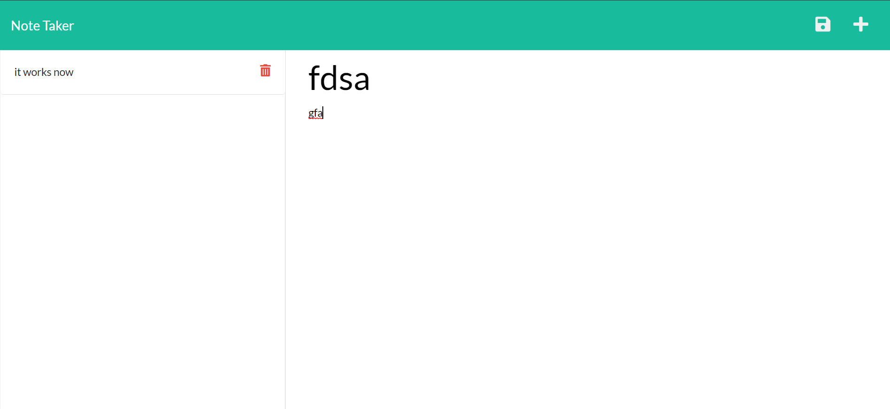

# note-taker


## Deployed link
* [note taking App](https://sivad-note-taker.herokuapp.com/)

## site picture



## Technologies Used
- HTML : Used to format the content of the page
- CSS : Used to style the HTML on the web browser
- JavaScript : Used to give the page logical functions 
- javascript (express) : module used to run servers in a js file
- heroku : to deply the website and server to the web
- Git : Used to version control the code during the creation process
- GitHub : hosting the repositroy responsible for the website

## Authors
- writen styled and built by Mason Davis

## summary
This repository contains all the code to generate and host a website meant to make note taking easier. it has a smooth interface and functional commands including viewing old notes, deleting notes and adding new notes.

## Code Snippet
This is a snippet Showing the formula used to display the content on the page, it is how the server gets the content that it is storing.

```javaScript
app.get('/api/notes',(req,res) =>{
res.json(noteContent)
});
```


## Author links
[LinkedIn](https://www.linkedin.com/in/davis-mason-t/)
[GitHub](https://github.com/Md7113)